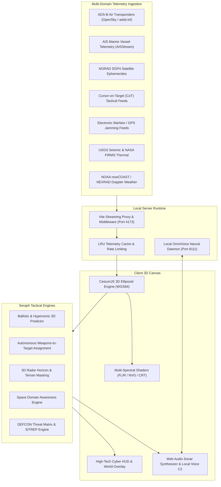

# 🛰️ PROJECT SERAPH

<div align="center">


**Sovereign Multi-Domain C4ISR & Autonomous Tactical Air/Missile Defense Command Platform**

*Real-time 3D planetary intelligence, Keplerian ballistic & boost-glide hypersonic trajectory prediction, autonomous weapons-to-target assignment (WTA), 3D radar horizon & terrain masking, space domain awareness (SDA), and 100% air-gapped on-device neural voice command.*

[Tactical Capabilities](#-core-tactical-capabilities) • [System Architecture](#-system-architecture) • [Voice & Hotkeys](#-tactical-hotkeys--voice-c2) • [Quick Start](#-quick-start) • [Security & Air-Gap](#-security--air-gap-compliance)

</div>

---

## 🦅 Operational Overview

**Project Seraph** (*Seraph Watch*) is an aerospace-grade Command, Control, Communications, Computers, Intelligence, Surveillance, and Reconnaissance (**C4ISR**) tactical battle management system operating in real-time within the browser. 

Engineered for strategic air defense commands, joint operations centers, and advanced intelligence fusion analysts, Seraph synthesizes distributed, high-throughput planetary telemetry across air, maritime, space, subsurface, and electronic warfare domains onto a millimeter-accurate photorealistic 3D WGS84 ellipsoid.

### Key Architectural Pillars:
* **True Kinetic Trajectory Physics**: Evaluates high-altitude sub-orbital ballistic parabolas (ICBM/IRBM) and non-ballistic atmospheric hypersonic boost-glide waveriders with real-time Time-To-Impact (TTI) countdowns and Circular Error Probable (CEP) ground hazard rings.
* **Autonomous Battle Management (WTA)**: Solves the NP-hard Weapons-to-Target Assignment problem in milliseconds, calculating single-shot and dual-salvo Kill Probability ($P_k$) across integrated air defense batteries (Patriot PAC-3, Aegis SM-6, S-400, Arrow-3, Iron Dome).
* **High-Fidelity Sensor Modeling**: Implements $4/3$ Earth atmospheric refraction radar horizons and 3D raycasted terrain elevation masking, identifying low-altitude nap-of-the-earth (NOE) cruise missile ingress corridors.
* **Space Domain Awareness (SDA)**: Projects optical, SAR, and ELINT reconnaissance satellite ground swath cones over strategic installations and tracks co-orbital anti-satellite (ASAT) proximity conjunctions ($<50\text{ km}$).
* **100% Air-Gapped & On-Device Voice C2**: Operates local speech recognition and low-latency neural OmniVoice synthesis with secure key provenance, configurable cloud proxies (OpenAI Realtime, Cesium Ion, Google Maps), and zero unauthorized telemetry leakage.

---

## ⚡ Core Tactical Capabilities

```
+-----------------------------------------------------------------------------------+
|                                  PROJECT SERAPH                                   |
|             Autonomous Multi-Domain C4ISR Intelligence Fusion Platform            |
+-----------------------------------------------------------------------------------+
                                          |
    +-------------------+-----------------+-------------------+-----------------+
    |                   |                                     |                 |
    v                   v                                     v                 v
[AIR & MISSILE]   [SPACE & RECON]                      [MARITIME DOMAIN]   [ELECTRONIC WARFARE]
Ballistic Parabolas SGP4 Satellite Orbits              AIS Vessel Telemetry GPS Jamming Contours
Hypersonic Gliders  Strategic Overflight Warning       Dark Vessel Detect   Spoofing Zones (SPOOF)
WTA Pk Matrix Solv  Co-Orbital ASAT Conjunction (<50km) Chokepoint Corridors CoT / Cursor-on-Target
Terrain Masking NOE Optical & SAR Sensor Swath Cones   Acoustic Sonar Ping  MIL-STD-2525D Symbology
```

### 1. 🚀 Ballistic & Hypersonic 3D Trajectory Predictor (`[Shift+B]`)
- **Keplerian Sub-Orbital Parabolas**: Simulates ballistic missile trajectories up to $1,200\text{ km}$ apogees based on genuine orbital mechanics, computing apex, velocity vectors, and re-entry points.
- **Hypersonic Waverider Flight Profiles**: Models non-ballistic high-Mach waveriders performing aerodynamic skip-glide maneuvers in the upper stratosphere ($30\text{–}60\text{ km}$).
- **Time-To-Impact (TTI) & CEP Impact Footprint**: Calculates live impact countdown timers and renders elliptical Circular Error Probable ground hazard rings for early warning defense networks.

### 2. 🎯 Autonomous Weapons-to-Target Assignment (WTA) Engine (`[Shift+W]`)
- **Algorithmic Threat Pairing**: Evaluates active global Integrated Air & Missile Defense (IAMD) batteries against inbound saturation raid bogeys.
- **Dynamic Kill Probability ($P_k$) Matrix**:
  - Computes single-shot $P_k$ degraded by bogey Mach velocity and cross-aspect angles:
    $$P_k = P_{\text{base}} \times \left(1 - \frac{M - 1}{15}\right) \times \left(1 - 0.35 \sin(\theta)\right)$$
  - Calculates dual-salvo ripple fire probability of kill:
    $$P_{k,\text{dual}} = 1 - (1 - P_k)^2$$
- **Interception Geometry**: Verifies kinematic engagement envelopes for MIM-104 Patriot PAC-3 MSE, Aegis SM-6 Dual II, S-400 Triumf, Arrow-3, and Iron Dome units.

### 3. 📡 3D Radar Line-of-Sight & Terrain Elevation Masking (`[Shift+M]`)
- **4/3 Earth Curvature Refraction**: Computes the atmospheric optical-to-radar horizon:
  $$d_{\text{horizon}} \approx 4.12 \times \left(\sqrt{h_{\text{radar}}} + \sqrt{h_{\text{target}}}\right) \text{ km}$$
- **Terrain Shadow Raycasting**: Samples terrain elevation along sensor-to-target sightlines to detect radar occlusion caused by mountain ridges and deep valleys.
- **NOE Penetration Alerts**: Immediately flags low-altitude hostile bogeys flying nap-of-the-earth trajectories through radar blind zones.

### 4. 🛰️ Space Domain Awareness & Overflight Warning (`[Shift+O]`)
- **Reconnaissance Swath Projection**: Projects instantaneous geometric sensor ground cones for foreign optical, SAR, and SIGINT surveillance satellites.
- **Facility Access Detection**: Automatically triggers overflight exposure warnings when foreign reconnaissance satellites pass over protected sovereign installations (Pentagon, STRATCOM Offutt AFB, NTTR Groom Lake, Ramstein AB, Yokosuka Naval Base, Pine Gap).
- **Orbital Conjunction / ASAT Warning**: Continuously calculates pairwise Euclidean separations between space assets and generates high-priority alerts for co-orbital approaches under $50\text{ km}$.

### 5. 📻 Electronic Warfare, GPS Jamming & Cursor-on-Target (CoT)
- **GPS Jamming & Spoofing Contours**: Visualizes electronic warfare sectors (GPS NO-FIX, DENIED, and SPOOFING) in active conflict zones.
- **Cursor-on-Target (CoT) Layer**: Ingests tactical MIL-STD CoT event streams with STANAG / MIL-STD-2525D combat symbology for joint force interoperability.
- **Doppler Weather & Storm Tracking**: Displays real-time NEXRAD radar reflectivity and tropical cyclone predictive tracks.

### 6. 🗣️ 100% On-Device Neural OmniVoice Control
- **Air-Gapped Speech Architecture**: Local Web Speech API / PyAudio front-end paired with a local Python OmniVoice neural inference engine running on `http://127.0.0.1:8111`.
- **Zero Cloud Dependence**: Operates completely offline without sending microphone audio, transcripts, or tactical state to OpenAI or any external third-party server.
- **Operational SITREP Audio**: Live procedural generation of classified situational reports read aloud by a tactical neural voice operator.

---

## 🛠️ System Architecture



---

## ⌨️ Tactical Hotkeys & Voice C2

### Primary Keyboard Shortcuts

| Shortcut | Function | Module |
| :--- | :--- | :--- |
| <kbd>Shift</kbd> + <kbd>B</kbd> | Toggle Ballistic & Hypersonic 3D Trajectory Predictor | `ballisticPredictor.js` |
| <kbd>Shift</kbd> + <kbd>W</kbd> | Solve Autonomous Weapons-to-Target Assignment (WTA) | `tacticalWta.js` |
| <kbd>Shift</kbd> + <kbd>M</kbd> | Toggle 3D Radar Line-of-Sight & Terrain Elevation Masking | `terrainMasking.js` |
| <kbd>Shift</kbd> + <kbd>O</kbd> | Toggle Space Domain Awareness & Overflight Warning | `spaceDomainAwareness.js` |
| <kbd>V</kbd> | Toggle Operator Voice C2 Session (Local OmniVoice) | `localVoiceSession.js` |
| <kbd>T</kbd> | Toggle FLIR Thermal Multi-Spectral Post-Processing Shader | `scene.js` |
| <kbd>N</kbd> | Toggle NVG Night Vision Phosphor Shader | `scene.js` |
| <kbd>C</kbd> | Toggle Tactical CRT Scanline Post-Processing Shader | `scene.js` |
| <kbd>1</kbd> – <kbd>5</kbd> | Set Operational Readiness State (DEFCON 1 through DEFCON 5) | `threatMatrix.js` |
| <kbd>Space</kbd> | Generate Live Tactical Situation Report (SITREP) | `tacticalSitrep.js` |

### Natural Voice Commands (100% On-Device)

Press <kbd>V</kbd> or click the microphone indicator to issue commands hands-free:

* *"Seraph, run ballistic trajectory"* → Activates 3D ballistic and waverider trajectory projections.
* *"Seraph, solve WTA / weapons to target"* → Solves optimal IAMD intercept pairings and logs $P_k$.
* *"Seraph, show terrain masking / radar horizon"* → Projects radar horizon frustums and highlights NOE bogeys.
* *"Seraph, monitor satellite passes / space domain"* → Evaluates strategic facility overflight coverage.
* *"Seraph, set DEFCON 2 / DEFCON 1"* → Updates operational readiness and acoustic alerts.
* *"Seraph, generate situation report"* → Synthesizes and recites a real-time multi-domain SITREP.
* *"Seraph, engage thermal vision / night vision"* → Swaps multi-spectral shader views.

---

## 🚀 Quick Start

### 1. Prerequisites
- **Node.js**: `24+` (recommended) or `22+`
- **Python**: `3.10+` (for local OmniVoice neural server)
- **Modern Browser**: Chrome / Edge / Brave with WebGL 2.0 acceleration enabled

### 2. Clone & Install Dependencies
```bash
# Clone the repository
git clone https://github.com/freshstart2066-create/heliosc2.git

# Enter project directory
cd heliosc2

# Install frontend and middleware dependencies
npm install

# (Optional) Install Python voice daemon dependencies
pip install kokoro-onnx soundfile sounddevice pyttsx3 flask flask-cors
```

### 3. Launch Local Tactical Environment
Start both the tactical C2 console and the on-device voice engine:

```bash
# Terminal 1: Launch Project Seraph Frontend Console
npm run dev

# Terminal 2: Launch Local On-Device OmniVoice Daemon (Port 8111)
python server/voice_server.py
```

Open your browser to:
```
http://localhost:4173/
```
The system will boot instantly into the **Seraph Tactical HUD** using keyless open elevation and satellite basemaps.

### 4. Running Verification Test Suite
Project Seraph enforces strict code health, zero Cesium label regressions, and tactical algorithmic correctness:

```bash
# Run the complete test suite (5,400+ unit & integration tests)
npm test

# Run the specialized tactical C4ISR engine test suite
node --test src/layers/ballisticPredictor.test.mjs src/tacticalWta.test.mjs src/layers/terrainMasking.test.mjs src/layers/spaceDomainAwareness.test.mjs src/voice/localVoiceSession.test.mjs src/noCesiumLabels.test.mjs
```

---

## 🔒 Security & Air-Gap Compliance

* **Zero Cloud Audio Egress**: All microphone recordings and tactical intents remain on `localhost`. No WebRTC connections or audio data are ever transmitted to OpenAI or cloud LLM APIs.
* **Strict Cesium Label Isolation**: To maintain high-frame-rate rendering under saturation raid conditions, all tactical identifiers are rendered via the dedicated HTML world-overlay rather than native Cesium labels, strictly passing `src/noCesiumLabels.test.mjs`.
* **Fail-Soft Telemetry**: If external feeds encounter network degradation or upstream rate limits, Seraph seamlessly transitions to cached dead-reckoning kinematics and synthetic threat projections without interrupting C2 operations.

---

## 📜 License & Provenance

Distributed under the **MIT License**. Third-party runtime telemetry feeds (NOAA, USGS, NASA FIRMS, CelesTrak, OpenSky, AISStream) are governed by their respective public data policies. See [`DATA_SOURCES.md`](DATA_SOURCES.md) for detailed attribution and licensing terms.
